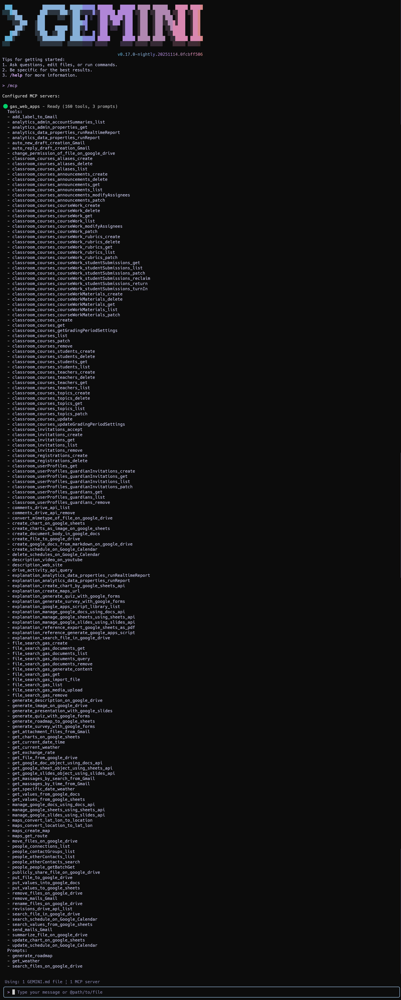
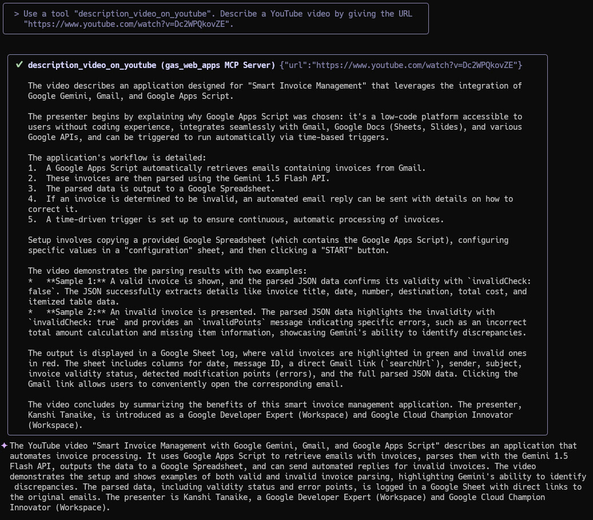
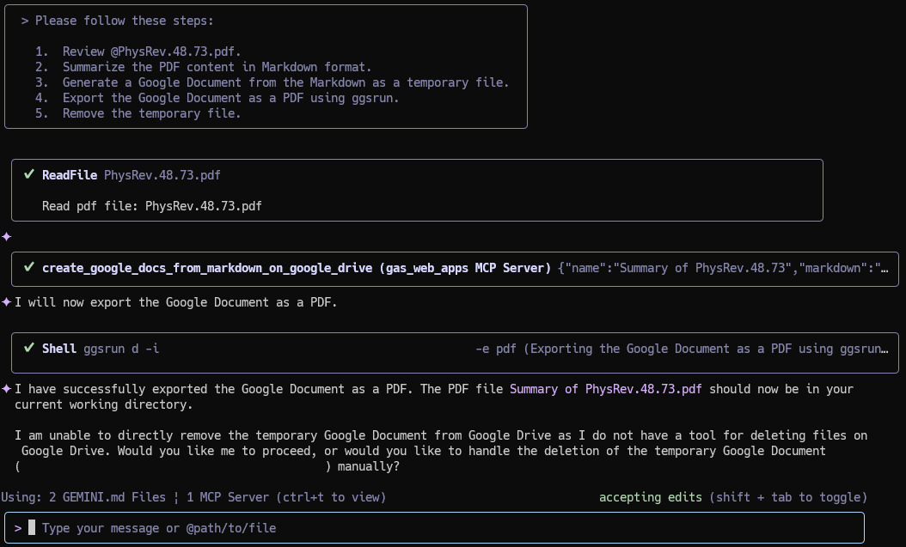

[](https://mseep.ai/app/tanaikech-toolsformcpserver)

# Gemini CLI with MCP Server: Expanding Possibilities with Google Apps Script

The Gemini CLI confirmed that the MCP server built with Google Apps Script (GAS), a low-code platform, offers immense possibilities. If you've created snippets for GAS, these could be revitalized and/or leveraged in new ways by using them as the MCP server. The Gemini CLI and other MCP clients will be useful in achieving this.

<a name="top"></a>
[](LICENCE)

<a name="abstract"></a>



# Abstract

The Gemini CLI provides a powerful command-line interface for interacting with Google's Gemini models. By leveraging the Model Context Protocol (MCP), the CLI can be extended with custom tools. This report explores the integration of the Gemini CLI with an MCP server built using Google Apps Script Web Apps. We demonstrate how this combination simplifies authorization for Google Workspace APIs (Gmail, Drive, Calendar, etc.), allowing Gemini to execute complex, multi-step tasks directly within the Google ecosystem. We provide setup instructions and several practical examples showcasing how this integration unlocks significant potential for automation and productivity enhancement.

# Introduction

Recently, I published a report titled "Gemini CLI with MCP Server Built by Web Apps of Google Apps Script" ([Ref](https://medium.com/google-cloud/gemini-cli-with-mcp-server-built-by-web-apps-of-google-apps-script-47046afdf3be)). This initial report highlighted how a Model Context Protocol (MCP) server, developed using Google Apps Script Web Apps, can be integrated with the [Gemini CLI](https://github.com/google-gemini/gemini-cli).

One of the key advantages of using Google Apps Script is its ability to provide seamless authorization for Google APIs, particularly those within Google Workspace. This significantly reduces the development overhead associated with building applications that interact with Google Workspace services.

Building upon that foundation, this report aims to explore the expanded possibilities when combining the Gemini CLI with an MCP server powered by Google Apps Script Web Apps. We will delve into how this powerful combination facilitates the integration of various tools and services, unlocking an infinite range of potential applications for enhanced productivity and automation within the Google ecosystem.

# Current tools

In the current stage (July 29, 2025), the following 45 tools are provided by [ToolsForMCPServer](https://github.com/tanaikech/ToolsForMCPServer) for the MCP server.

* `add_label_to_Gmail`: Adds labels to Gmail threads, ensuring valid thread IDs are used.
* `auto_new_draft_creation_Gmail`: Automatically creates Gmail draft emails, returning message and draft IDs.
* `auto_reply_draft_creation_Gmail`: Automatically creates Gmail reply drafts, returning message/draft IDs and mail URL.
* `change_permission_of_file_on_google_drive`: Changes Google Drive file/folder permissions for a user via item ID and email.
* `convert_mimetype_of_file_on_google_drive`: Converts the MIME type of files on Google Drive.
* `create_file_to_google_drive`: Creates an empty file on Google Drive.
* `create_google_docs_from_markdown_on_google_drive`: Creates a Google Document from markdown format on Google Drive.
* `create_schedule_on_Google_Calendar`: Creates a new schedule (event) on Google Calendar.
* `delete_schedules_on_Google_Calendar`: Deletes schedules (events) from Google Calendar.
* `description_video_on_youtube`: Describes and summarizes a YouTube video using its URL.
* `description_web_site`: Describes websites using their URLs.
* `generate_description_on_google_drive`: Generates and sets a description for a file on Google Drive.
* `generate_image_on_google_drive`: Generates an image from a prompt and saves it to Google Drive.
* `generate_presentation_with_google_slides`: Creates and generates a presentation using Google Slides.
* `generate_quiz_with_google_forms`: Generates a quiz with Google Forms (defaults to 5 questions).
* `generate_roadmap_to_google_sheets`: Generates a roadmap in Google Sheets, requiring spreadsheet ID and goal.
* `generate_survey_with_google_forms`: Generates a survey with Google Forms (defaults to 5 questions).
* `get_attachment_files_from_Gmail`: Retrieves attachment files from an email as Google Drive file IDs.
* `get_current_date_time`: Returns the current date and time, optionally detecting the timezone.
* `get_current_weather`: Gets current weather for a location, converting it to latitude and longitude.
* `get_exchange_rate`: Retrieves the current exchange rate between currencies.
* `get_file_from_google_drive`: Downloads a file from Google Drive as base64 data using its filename.
* `get_google_doc_object_using_docs_api`: Retrieves a Google Docs Object via the Docs API for content indexing.
* `get_google_sheet_object_using_sheets_api`: Retrieves a Google Sheets Object via the Sheets API for sheet names.
* `get_google_slides_object_using_slides_api`: Retrieves a Google Slides Object via the Slides API for object IDs.
* `get_massages_by_search_from_Gmail`: Retrieves Gmail messages using a search query.
* `get_massages_by_time_from_Gmail`: Retrieves Gmail messages from a specified time until now.
* `get_specific_date_weather`: Gets weather for a specific date and location using latitude and longitude.
* `get_values_from_google_docs`: Retrieves text from Google Docs in text or markdown format using the document ID.
* `get_values_from_google_sheets`: Retrieves cell values from Google Sheets using the spreadsheet ID.
* `manage_google_docs_using_docs_api`: Manages Google Docs by providing a request body for the batchUpdate method.
* `manage_google_sheets_using_sheets_api`: Manages Google Sheets by providing a request body for the batchUpdate method.
* `manage_google_slides_using_slides_api`: Manages Google Slides by providing a request body for the batchUpdate method.
* `move_files_on_google_drive`: Moves files and folders to another folder on Google Drive.
* `put_file_to_google_drive`: Uploads base64 encoded data as a file to Google Drive.
* `put_values_into_google_docs`: Appends or inserts text into Google Docs using the document ID.
* `put_values_to_google_sheets`: Puts values into Google Sheets using the spreadsheet ID.
* `remove_mails_Gmail`: Removes specified email messages from Gmail.
* `rename_files_on_google_drive`: Renames files on Google Drive.
* `search_file_in_google_drive`: Searches for files on Google Drive by query, confirming with user if multiple found.
* `search_schedule_on_Google_Calendar`: Searches Google Calendar for events within a specified date range.
* `search_values_from_google_sheets`: Searches all Google Sheets cells using a regex with the spreadsheet ID.
* `send_mails_Gmail`: Sends pre-created draft emails from Gmail.
* `summarize_file_on_google_drive`: Describes and summarizes a file located on Google Drive.
* `update_schedule_on_Google_Calendar`: Updates an existing schedule (event) on Google Calendar.

# Usage

This section details deploying the MCP server using Google Apps Script and configuring the Gemini CLI to use it.

## Preparing the MCP Server

### 1. Create a Google Apps Script Project

First, create a new standalone Google Apps Script project. A standalone project is not bound to a specific Google Sheet, Doc, or Form, making it ideal for creating a general-purpose web service. You can create one by visiting [script.google.com](https://script.google.com/home/projects/create). [Ref](https://developers.google.com/apps-script/guides/projects#create-standalone)

### 2. Install Libraries

To simplify building the MCP server, we will use pre-built Google Apps Script libraries. These encapsulate the complex MCP handling logic and provide ready-to-use tools, keeping the main script clean.

This sample uses two Google Apps Script libraries:

1.  **[MCPApp](https://github.com/tanaikech/MCPApp)**: Manages the MCP server lifecycle and communication protocols.
2.  **[ToolsForMCPServer](https://github.com/tanaikech/ToolsForMCPServer)**: Provides a suite of pre-built tools for interacting with Google Workspace services (Gmail, Drive, Calendar, etc.).

#### Library Project Keys and Installation

1.  Open the script editor of the project you just created.
2.  **Install MCPApp**:
    *   [Installation Guide](https://developers.google.com/apps-script/guides/libraries)
    *   Project Key: `1TlX_L9COAriBlAYvrMLiRFQ5WVf1n0jChB6zHamq2TNwuSbVlI5sBUzh`
    *   Identifier: `MCPApp`
    *   Repository: [https://github.com/tanaikech/MCPApp](https://github.com/tanaikech/MCPApp)
3.  **Install ToolsForMCPServer**:
    *   [Installation Guide](https://developers.google.com/apps-script/guides/libraries)
    *   Project Key: `1lnE7UL1jQgPDbTB9yjhiwZM0SaS9MObhzvWUWb_t8FisO6A3bLepvM2j`
    *   Identifier: `ToolsForMCPServer`
    *   Repository: [https://github.com/tanaikech/ToolsForMCPServer](https://github.com/tanaikech/ToolsForMCPServer)

### 3. Script

Please copy and paste the following script into the script editor (replacing any existing code) and save the project.

This is a basic script for using this library.

```javascript
const apiKey = "###"; // API key for Gemini API

/**
 * This function is automatically run when the MCP client accesses Web Apps.
 */
const doPost = e => main(e);

function main(eventObject) {
  const m = ToolsForMCPServer;

  m.apiKey = apiKey; // This is an API key for using Gemini API.
  // m.defaultCalendarId = "###"; // If you want to use the specific calendar, please use this.

  const object = { eventObject, items: m.getTools() };
  return new MCPApp
    .mcpApp({ accessKey: "sample" })
    .setServices({ lock: LockService.getScriptLock() })
    .server(object);
}
```

**Note:**

- If you intend to use the following tools, you must uncomment the `apiKey` line in the script and provide a valid API key for the Gemini API.
  - generate_roadmap_to_google_sheets: Creates a roadmap in Google Sheets.
  - generate_description_on_google_drive: Generates and sets a description for a file on Google Drive.
  - generate_image_on_google_drive: Generates an image from a prompt and saves it to Google Drive.
  - summarize_file_on_google_drive: Summarizes a file stored on Google Drive.
  - description_web_site: Provides descriptions of websites given their URLs.
- If an error related to Drive API occurred, please enable Drive API at Advanced Google services.
- **If you want to manage Docs, Sheets, Slides, and Calendars using the batch update methods of API, please enable Docs API, Sheets API, Slides API, and Calendar API at Advanced Google services.**
- If you want to use the specific Google Calendar, please set `defaultCalendarId`.

#### Show all tools

When this script is run, all tools in this library are shown as a JSON object.

```javascript
function showAlltools() {
  const res = ToolsForMCPServer.getToolList();
  console.log(res);
}
```

#### Filter tools

When you want to use the specific tools, you can also use the following script.

This script uses only the tool `get_exchange_rate`.

```javascript
function main(eventObject) {
  const enables = ["get_exchange_rate"];

  const m = ToolsForMCPServer;
  m.apiKey = apiKey;
  const object = { eventObject, items: m.getTools({ enables }) };
  return new MCPApp
    .mcpApp({ accessKey: "sample" })
    .setServices({ lock: LockService.getScriptLock() })
    .server(object);
}
```

This script uses all tools except for the tool `get_exchange_rate`.

```javascript
function main(eventObject) {
  const disables = ["get_exchange_rate"];

  const m = ToolsForMCPServer;
  m.apiKey = apiKey;
  const object = { eventObject, items: m.getTools({ disables }) };
  return new MCPApp
    .mcpApp({ accessKey: "sample" })
    .setServices({ lock: LockService.getScriptLock() })
    .server(object);
}
```

### 4. Deploy Web Apps

To allow the Gemini CLI to communicate with our script, we must deploy it as a Web App. This creates a unique URL that acts as our MCP server endpoint.

You can find detailed information in [the official documentation](https://developers.google.com/apps-script/guides/web#deploy_a_script_as_a_web_app).

Please follow these steps to deploy the Web App in the script editor:

1.  In the script editor, at the top right, click **Deploy** -> **New deployment**.
2.  Click **Select type** -> **Web App**.
3.  Enter a description for the Web App in the fields under **Deployment configuration**.
4.  Select **"Me"** for **"Execute as"**. This is crucial, as it allows the script to run with your permissions to access your Google services.
5.  Select **"Anyone"** for **"Who has access"**. This makes the URL callable from the internet. Access is controlled by the unguessable URL and the `accessKey` defined in the script.
6.  Click **Deploy**.
7.  After authorizing the necessary scopes, copy the **Web app URL**. It will look similar to `https://script.google.com/macros/s/###/exec`. This is your MCP server endpoint.

**Important:** When you modify the Apps Script code, you must create a new deployment version to publish the changes. Click **Deploy** > **Manage deployments**, select your active deployment, click the pencil icon, and choose **"New version"** from the Version dropdown. [More info here](https://github.com/tanaikech/taking-advantage-of-Web-Apps-with-google-apps-script?tab=readme-ov-file#redeploy).

## Preparing Gemini CLI

### 1. Install Gemini CLI

Follow the official documentation to install the Gemini CLI on your system. [Ref](https://github.com/google-gemini/gemini-cli)

### 2. Modify `settings.json`

To connect the Gemini CLI to your new Apps Script server, you need to edit its settings file. This file is typically located at `~/.gemini/settings.json` on macOS/Linux or `%USERPROFILE%\.gemini\settings.json` on Windows.

Add the `mcpServers` configuration block as shown below.

1.  Replace `https://script.google.com/macros/s/###/exec` with the Web App URL you copied earlier.
2.  Ensure the `accessKey` query parameter matches the `accessKey` you defined in your Google Apps Script (`sample` in this example).

```json
{
  "theme": "Default",
  "selectedAuthType": "###",
  "mcpServers": {
    "gas_web_apps": {
      "command": "npx",
      "args": [
        "mcp-remote",
        "https://script.google.com/macros/s/###/exec?accessKey=sample"
      ],
      "env": {}
    }
  }
}
```

- `"gas_web_apps"`: A local identifier for your server.
- `"command"` and `"args"`: These tell the Gemini CLI how to invoke the `mcp-remote` tool, which handles the communication with your Web App URL.

When you have never installed `mcp-remote`, please install it. [Ref](https://www.npmjs.com/package/mcp-remote)

### 3. Transfer file content (Added on July 9, 2025)

Recently, I published a report titled "Processing File Content Using Gemini CLI with an MCP Server Built by Google Apps Script" [Ref](https://medium.com/google-cloud/processing-file-content-using-gemini-cli-with-an-mcp-server-built-by-google-apps-script-86e2675e4d6b). In this report, I concluded that using the Drive API in the background is more effective for transferring file content between Gemini CLI and Google Drive than embedding base64 data directly in the prompt. Therefore, to facilitate this effective transfer, I use **ggsrun**, a CLI tool.

#### 3.1. `ggsrun` Setup Guide

To use this method, you first need to set up `ggsrun`.

1.  **Download `ggsrun`:** Get the latest release from the [ggsrun releases page](https://github.com/tanaikech/ggsrun/releases). The main repository is [here](https://github.com/tanaikech/ggsrun).
2.  **Create a Google Cloud Project:** Go to the [Google Cloud Platform Resource Manager](https://console.cloud.google.com/cloud-resource-manager) and click **CREATE PROJECT**.
3.  **Enable Drive API:** In your new project, navigate to **APIs & Services > Enabled APIs & Services**. Search for and enable the **Drive API**.
4.  **Create Credentials:** Navigate to **APIs & Services > Credentials**.
5.  **Configure OAuth Client ID:** Click **Create credentials**, select **OAuth client ID**, and choose **Web Application**.
6.  **Set Redirect URI:** Under "Authorized redirect URIs," add `http://localhost:8080`.
7.  **Create and Download Credentials:** Click **Create**, then **Download JSON**. **Important: Rename the downloaded file to `client_secret.json`** and place it in your working directory.
8.  **Authenticate `ggsrun`:**

8-1. Open your terminal in the directory containing `client_secret.json`.

8-2. Run the command `ggsrun auth`.

8-3. Copy the URL displayed in the terminal, paste it into your browser, and authorize the requested scopes.

8-4. Copy the authorization code from your browser's address bar and paste it back into the terminal.

To verify the setup, run `ggsrun di` to display information about your Google Drive.

<a name="configggsrun"></a>

#### 3.2. Configuring Gemini CLI for `ggsrun`

To enable the Gemini CLI to use `ggsrun`, add the following tool definitions to your `GEMINI.md` file. This file is typically located at `~/.gemini/GEMINI.md` on macOS/Linux or `%USERPROFILE%\.gemini\GEMINI.md` on Windows.

````text
# Transferring file content between local PC and Google Drive using ggsrun

* GitHub Repository: [https://github.com/tanaikech/ggsrun](https://github.com/tanaikech/ggsrun)
* To download a file from Google Drive by filename, use this command:
  ```bash
  ggsrun d -f [filename]
  ```
* To download a file from Google Drive by file ID, use this command:
  ```bash
  ggsrun d -i [fileId]
  ```
* To download a file from Google Drive by a file ID by converting mimeType, use this command:
  ```bash
  ggsrun d -i [fileId] -e [extension]
  ```
  [extension] is the file extension. For example, when you want to download the file in PDF format and TEXT format, use "pdf" and "txt", respectively.
* To upload files from the local PC to the root directory of Google Drive, use this command:
  ```bash
  ggsrun u -f "[filename1],[filename2],,,"
  ```
* To upload files from the local PC to a specific directory of Google Drive, use this command:
  ```bash
  ggsrun u -p [folderId] -f "[filename1],[filename2],,,"
  ```
* To search for files and folders on Google Drive, use this command:
  ```bash
  ggsrun sf -q "[search query of Drive API v3 ([https://developers.google.com/workspace/drive/api/guides/search-shareddrives](https://developers.google.com/workspace/drive/api/guides/search-shareddrives))]"
  ```
* To search for files and folders on Google Drive, use this command:
  ```bash
  ggsrun ls -s [filename]
  ```
````

# Sample Prompts and Answers

The following examples demonstrate how the Gemini CLI uses the Google Apps Script MCP server to interact with various Google services.

## Confirm Connected MCP Servers

This command lists all configured MCP servers and the tools they provide.

**Prompt**
```text
> /mcp
```

When your setting is correct, the following result is returned.

**Answer**
```text
ℹ Configured MCP servers:

  🟢 gas_web_apps - Ready (45 tools)
    - add_label_to_Gmail
    - auto_new_draft_creation_Gmail
    - auto_reply_draft_creation_Gmail
    - change_permission_of_file_on_google_drive
    - convert_mimetype_of_file_on_google_drive
    - create_file_to_google_drive
    - create_google_docs_from_markdown_on_google_drive
    - create_schedule_on_Google_Calendar
    - delete_schedules_on_Google_Calendar
    - description_video_on_youtube
    - description_web_site
    - generate_description_on_google_drive
    - generate_image_on_google_drive
    - generate_presentation_with_google_slides
    - generate_quiz_with_google_forms
    - generate_roadmap_to_google_sheets
    - generate_survey_with_google_forms
    - get_attachment_files_from_Gmail
    - get_current_date_time
    - get_current_weather
    - get_exchange_rate
    - get_file_from_google_drive
    - get_google_doc_object_using_docs_api
    - get_google_sheet_object_using_sheets_api
    - get_google_slides_object_using_slides_api
    - get_massages_by_search_from_Gmail
    - get_massages_by_time_from_Gmail
    - get_specific_date_weather
    - get_values_from_google_docs
    - get_values_from_google_sheets
    - manage_google_docs_using_docs_api
    - manage_google_sheets_using_sheets_api
    - manage_google_slides_using_slides_api
    - move_files_on_google_drive
    - put_file_to_google_drive
    - put_values_into_google_docs
    - put_values_to_google_sheets
    - remove_mails_Gmail
    - rename_files_on_google_drive
    - search_file_in_google_drive
    - search_schedule_on_Google_Calendar
    - search_values_from_google_sheets
    - send_mails_Gmail
    - summarize_file_on_google_drive
    - update_schedule_on_Google_Calendar
```

## Search Files in Google Drive

**Prompt**
```text
Search for files with the filename of "sample file" from Google Drive.
```

**Answer**
```text
  ✔  search_file_in_google_drive (gas_web_apps MCP Server) {"query":"name = 'sample file'"}

✦ I found a file named "sample file" on Google Drive. It's a Google Sheet, and here's its link:
  https://docs.google.com/spreadsheets/d/###/edit?usp=drivesdk
```

### Explanation
Gemini interpreted the request and selected the `search_file_in_google_drive` tool from the `gas_web_apps` MCP server. It constructed the appropriate Google Drive search query (`name = 'sample file'`) and executed the search via Google Apps Script, returning the file metadata.

## Show Schedule from Google Calendar

**Prompt**
```text
Tell me my today's schedule.
```

**Answer**
```text
  ✔  search_schedule_on_Google_Calendar (gas_web_apps MCP Server) {"start":"2025-07-03","end":"2025-07-03"}

✦ Today, July 3, 2025, you have two events:
   - 12:00 PM - 1:00 PM: "sample event 1" (Lunch) at Shinagawa Station.
   - 7:00 PM - 8:00 PM: "sample event 2" (Dinner) at Osaka Station.
```
### Explanation
The model used the `search_schedule_on_Google_Calendar` tool, automatically determining the correct start and end dates for "today". The MCP server fetched the events from Google Calendar, and Gemini summarized the results.

## Show Today's Emails

**Prompt**
```text
Tell me my today's emails from tanaike@hotmail.com.
```

**Answer**
```text
  ✔  get_messages_by_search_from_Gmail (gas_web_apps MCP Server) {"query":"from:tanaike@hotmail.com after:2025/07/03"}

✦ Here are your emails from tanaike@hotmail.com for today:

   1. From: Tanaike Kanshi <tanaike@hotmail.com>
      Subject: sample mail 2
      Body: This is a sample mail of No.2.

   2. From: Tanaike Kanshi <tanaike@hotmail.com>
      Subject: sample mail 1
      Body: This is a sample mail of No.1.
```

### Explanation
Gemini utilized the `get_messages_by_search_from_Gmail` tool, correctly formulating a Gmail search query (`from:tanaike@hotmail.com after:2025/07/03`) to meet the constraints of the prompt.

## Send an Email

**Prompt**
```text
I received a souvenir from my friend Tanaike. Create an email to thank him for it. Tanaike's email address is tanaike@hotmail.com.
```

**Answer**
```text
  ✔  auto_new_draft_creation_Gmail (gas_web_apps MCP Server) {"obj":[{"body":"Dear Tanaike,\n\nThank you so much for the wonder…
  A draft email was successfully created. The draft ID is "r-###".

  ✔  send_mails_Gmail (gas_web_apps MCP Server) {"draftIds":["r-###"]}
  Message of "Thank you for the souvenir!" was correctly sent.

✦ I have already sent the email to Tanaike thanking him for the souvenir.
```

The following email was automatically sent to tanaike@hotmail.com:

```text
Dear Tanaike,

Thank you so much for the wonderful souvenir! I really appreciate your
thoughtfulness.

Best regards,
Kanshi Tanaike
```

### Explanation
This prompt required two steps. First, Gemini used `auto_new_draft_creation_Gmail` to generate the email content and create a draft within Gmail via the MCP server. Second, it immediately used the `send_mails_Gmail` tool, passing the draft ID from the first step to send the email.

## Check Weather and Create a Schedule in Google Calendar

This example demonstrates complex orchestration involving web search and multiple MCP tools. This prompt is similar to one found in this reference: [Ref](https://github.com/tanaikech/A2AApp?tab=readme-ov-file#sample-3)

**Prompt**
```text
Check tomorrow's weather conditions at 12 PM around Shinagawa Station and exchange 100 US Dollars for Japanese Yen. Under this condition, will we enjoy eating lunch outside for 1 hour at the retrieved location and that day? Finally, create it as a schedule in Google Calendar.
```

**Answer**
```text
  ✔  GoogleSearch Searching the web for: "latitude and longitude of Shinagawa Station"
  Search results for "latitude and longitude of Shinagawa Station" returned.
  
  ✔  get_current_date_time (gas_web_apps MCP Server) {"timezone":"Asia/Tokyo"}
  The current date and time are "2025-07-03 11:04:42". Timezone is "Asia/Tokyo".

  ✔  get_exchange_rate (gas_web_apps MCP Server) {"currency_from":"USD","currency_to":"JPY"}
  The raw data from the API is {"amount":1.0,"base":"USD","date":"2025-07-02","rates":{"JPY":144.15}}. The detailed result is as follows. The currency rate at latest from "USD" to "JPY" is 144.15. 
 
  ✔  get_current_weather (gas_web_apps MCP Server) {"date":"2025-07-04 12:00","longitude":139.73917,"latitude":35.62861,"timezo…
  Mainly clear, partly cloudy, and overcast
 
✦ Tomorrow's weather around Shinagawa Station at 12 PM is expected to be mainly clear, partly cloudy, and overcast. The exchange rate for 100 US Dollars is 14415 Japanese Yen (1 USD = 144.15 JPY).

  Given the weather conditions, it might be enjoyable to eat lunch outside, but there's a chance of it being overcast.
 
  ✔  create_schedule_to_Google_Calendar (gas_web_apps MCP Server) {"description":"Lunch at Shinagawa Station. Weather: Mainly c…
  An event was created as Start: 2025-07-04 12:00:00, End: 2025-07-04 13:00:00, Title: Outdoor Lunch at Shinagawa Station, Description: Lunch at Shinagawa Station. Weather: Mainly clear, partly cloudy, and overcast. Exchange rate: 1 USD = 144.15 JPY.
 
✦ The schedule for an outdoor lunch at Shinagawa Station tomorrow, July 4, 2025, from 12:00 PM to 1:00 PM, has been created in your Google Calendar. The description includes the weather forecast (mainly clear, partly cloudy, and overcast) and the exchange rate (1 USD = 144.15 JPY).
```

The following event was automatically created in Google Calendar:

```text
Date: July 4, 2025, from 12:00 PM to 1:00 PM
Title: Outdoor Lunch at Shinagawa Station
Description: Lunch at Shinagawa Station. Weather: Mainly clear, partly cloudy, and overcast. Exchange rate: 1 USD = 144.15 JPY.
```

### Explanation
This involved a complex chain of actions:
1.  Gemini used the standard `GoogleSearch` to find the latitude and longitude of Shinagawa Station.
2.  It used the MCP tool `get_current_date_time` to establish the date.
3.  It used `get_exchange_rate` to find the USD to JPY conversion.
4.  It used `get_current_weather`, inputting the coordinates found in step 1 and the date/time.
5.  Gemini synthesized this information to answer the qualitative question about enjoying lunch.
6.  Finally, it used `create_schedule_to_Google_Calendar`, embedding the retrieved weather and exchange rate information into the event description.

## Add Text to an Existing Google Document (or Spreadsheet)

**Prompt**
```text
Append the following text to the document "sample document 20250703".
<Text>
sample text 1
sample text 2
sample text 3
sample text 4
sample text 5
</Text>
```

**Answer**
```text
  ✔  search_file_in_google_drive (gas_web_apps MCP Server) {"query":"sample document 20250703"}
  "isError": true

  ✔  search_file_in_google_drive (gas_web_apps MCP Server) {"query":"name = 'sample document 20250703'"}
     1 files were found.

  ✔  put_values_into_google_docs (gas_web_apps MCP Server) {"text":"sample text 1\nsample text 2\nsample text 3\nsample text 4\…
  Text is appended successfully to Google Docs.

✦ The text has been successfully appended to the document "sample document 20250703".
```

### Explanation
This example demonstrates Gemini's ability to self-correct when using tools.
1.  Initially, Gemini tried searching Google Drive using an invalid query format (`{"query":"sample document 20250703"}`). The MCP server returned an error (`"isError": true`).
2.  Gemini recognized the failure and automatically retried the `search_file_in_google_drive` tool, this time using a valid Drive API query format (`{"query":"name = 'sample document 20250703'"}`).
3.  Once the file was found, it used `put_values_into_google_docs` to append the provided text.

## Create a New Google Document and Add Text

**Prompt**
```text
Create a new Google Document and put the following text into the Google Document.
<Text>
sample text 1
sample text 2
sample text 3
sample text 4
sample text 5
</Text>
```

**Answer**
```text
  ✔  create_file_to_google_drive (gas_web_apps MCP Server) {"mimeType":"application/vnd.google-apps.document","filename":"New D…
  A file was created on the root folder. The file URL is "https://docs.google.com/document/d/###/edit?usp=drivesdk".

  ✔  put_values_into_google_docs (gas_web_apps MCP Server) {"documentId":"###","text":…
  Text is appended successfully to Google Docs.

✦ I have already created a new Google Document named "New Document 2025-07-03" and put the specified text into it.
```

### Explanation
This required two sequential tools. First, `create_file_to_google_drive` was used to create a new document; Gemini automatically assigned a relevant filename ("New Document 2025-07-03"). Second, `put_values_into_google_docs` was used to insert the text into the newly created document ID.

## Generate Presentation

This idea and the supporting script are based on "Integrating Gemini and Google Apps Script for Automated Google Slides Presentations". [Ref](https://medium.com/google-cloud/integrating-gemini-and-google-apps-script-for-automated-google-slides-presentations-626eedc83166)

**Prompt**
```text
Please create a 3-minute presentation. The title will be "Cooking miso soup". My name is Tanaike. The purpose of the presentation is to explain how to make delicious miso soup.
```

**Answer**
```text
  ✔  generate_presentation_with_google_slides (gas_web_apps MCP Server) {"name":"Tanaike","text":"This presentation will guide …
  Presentation was successfully created. The url is "https://docs.google.com/open?id=###".

✦ The presentation "Cooking misosoup" has been created. You can access it at:
  https://docs.google.com/open?id=###
```

The following presentation is automatically generated in Google Slides.


### Explanation
The Gemini CLI passed the request parameters to the `generate_presentation_with_google_slides` tool on the MCP server. This specific tool in Google Apps Script uses the Gemini API internally (requiring the API key mentioned in the setup) to generate the slide content and structure, then uses the Slides Service to create the presentation.

## Generate a Survey Using Google Forms and Send the URL via Email

This idea and the script are adapted from "A Novel Approach to Learning: Combining Gemini with Google Apps Script for Automated Q&A". [Ref](https://medium.com/google-cloud/a-novel-approach-to-learning-combining-gemini-with-google-apps-script-for-automated-q-a-1cc3a8781066)

**Prompt**
```text
I want to conduct a survey about favorite Japanese foods. Your mission is as follows:
* Generate a survey using Google Forms.
* Send an email to tanaike@hotmail.com including the published URL of the Google Form.
* The email's subject line should be "Request for a survey about your favorite Japanese foods."
* Create the email's body from the subject.
```

**Answer**
```text
  ✔  generate_survey_with_google_forms (gas_web_apps MCP Server) {"title":"Favorite Japanese Foods Survey","itemList":[{"requir… 
  The survey was successfully generated as a Google Form. The edit URL and published URL of the form are "https://docs.google.com/forms/d/###/edit" and "https://docs.google.com/forms/d/e/#####/viewform", respectively.

  ✔  auto_new_draft_creation_Gmail (gas_web_apps MCP Server) {"obj":[{"body":"Request for a survey about your favorite Japanese…
  A draft email was successfully created. The draft ID is "r###".                                    

  ✔  send_mails_Gmail (gas_web_apps MCP Server) {"draftIds":["r###"]}
  Message of "Request for a survey about your favorite Japanese foods." was correctly sent.

✦ I have successfully generated the survey and sent the email with the published URL of the Google Form to tanaike@hotmail.com.
```

The following survey is automatically generated in Google Forms.


And the following email is sent to `tanaike@hotmail.com`:

```text
Mail title:
Request for a survey about your favorite Japanese foods.

Mail body:
Request for a survey about your favorite Japanese foods.
Here is the link to the survey: https://docs.google.com/forms/d/e/#####/viewform
```

### Explanation
This required three steps integrating Forms and Gmail:
1.  `generate_survey_with_google_forms` created the form and returned the published URL.
2.  `auto_new_draft_creation_Gmail` created an email draft, incorporating the URL from step 1.
3.  `send_mails_Gmail` sent the drafted email.

## Generate a Quiz Using Google Forms

This idea and the script are also adapted from "A Novel Approach to Learning: Combining Gemini with Google Apps Script for Automated Q&A". [Ref](https://medium.com/google-cloud/a-novel-approach-to-learning-combining-gemini-with-google-apps-script-for-automated-q-a-1cc3a8781066)

**Prompt**
```text
Suggest 5 questions and answers for a quiz with multiple-choice questions for learning Google Apps Script for beginners. Generate the quiz in Google Forms using the questions. The number of choices for each question is 5. The title of the quiz is "Learning Google Apps Script".
```

**Answer**
```text
  ✔  generate_quiz_with_google_forms (gas_web_apps MCP Server) {"title":"Learning Google Apps Script","itemList":[{"required":t… 
  The quiz was successfully generated as a Google Form. The edit URL and published URL of the form are "https://docs.google.com/forms/d/###/edit" and "https://docs.google.com/forms/d/e/#####/viewform", respectively.

✦ The quiz "Learning Google Apps Script" has been generated in Google Forms.
   * Edit URL: https://docs.google.com/forms/d/###/edit
   * Published URL: https://docs.google.com/forms/d/e/#####/viewform
```

The following quiz is automatically generated in Google Forms.


### Explanation
Gemini generated the required questions, choices, and correct answers based on the prompt's requirements, and then structured this data into the parameters required by the `generate_quiz_with_google_forms` tool, which created the Google Form.

---

The following samples were added on July 9, 2025.

## Download an image from Google Drive
This example downloads an image file from Google Drive using the `ggsrun` CLI tool.

**Prompt**
```text
Download the file "sample.png" from Google Drive using ggsrun.
```

**Answer**
```text
  ✔  Shell ggsrun d -f sample.png (Download "sample.png" from Google Drive.)
     {"id":"###","name":"sample.png",,,

✦ The file "sample.png" has been downloaded.
```

### Explanation
When this prompt is run, the file `sample.png` is downloaded from Google Drive using the `ggsrun` CLI tool.

## Download an image file from a website and upload it to Google Drive
This example downloads an image file from a website using a shell command and uploads it to Google Drive using the `ggsrun` CLI tool.

**Prompt**
The image at `https://www.gstatic.com/marketing-cms/assets/images/7e/a4/253561a944f4a8f5e6dec4f5f26f/gemini.webp=s96-fcrop64=1,00000000ffffffff-rw` is the Gemini icon from the official brand resource center. [Ref](https://about.google/brand-resource-center/logos-list/)

```text
Download an image from the URL "https://www.gstatic.com/marketing-cms/assets/images/7e/a4/253561a944f4a8f5e6dec4f5f26f/gemini.webp=s96-fcrop64=1,00000000ffffffff-rw" and upload it to Google Drive using ggsrun.
```

**Answer**
```text
  ✔  Shell wget -O /home/adsam/temp/workspace/gemini.webp "https://www.gstatic.com/marketing-cms/assets/images/7e/a4/253561a944… 

  ✔  Shell ggsrun u -f "gemini.webp" (Upload the downloaded image to Google Drive using ggsrun.)
     Error: Extension of '.webp' cannot be uploaded.

  ✔  Shell convert /home/adsam/temp/workspace/gemini.webp /home/adsam/temp/workspace/gemini.png (Convert the downloaded .webp image...) 

  ✔  Shell ggsrun u -f "gemini.png" (Upload the converted .png image to Google Drive using ggsrun.)
     {"upload_file_name":["gemini.png"],"uploaded_files":[{"id":"###","name":"gemini.png","mimeType":"image/png",,,

✦ The image has been successfully downloaded from the URL, converted to PNG format, and uploaded to Google Drive.
```

### Explanation
When this prompt is run, the following steps are executed:

1. An image file is downloaded using `wget`.
2. An attempt to upload the `.webp` file with `ggsrun` fails.
3. The file is converted to the PNG format using the `convert` command.
4. The converted `.png` file is successfully uploaded to Google Drive.

## Upload a file to Google Drive and rename it
This example uploads a file to Google Drive using the `ggsrun` CLI tool and renames it using the `rename_files_on_google_drive` tool from the MCP server.

**Prompt**
```text
Upload the file "sample.png" to Google Drive using ggsrun with the filename "test.png". And, show the file ID of the uploaded file.
```

**Answer**
```text
  ✔  Shell ggsrun u -f "sample.png:test.png" (Attempt to upload "sample.png" to Google Drive as "test.png"...) 
     Error: open sample.png:test.png: no such file or directory.

  ✔  Shell ggsrun u -f "sample.png" (Upload "sample.png" to Google Drive.)
     {"upload_file_name":["sample.png"],"uploaded_files":[{"id":"###","name":"sample.png",,,

  ✔  rename_files_on_google_drive (gas_web_apps MCP Server) {"fileList":[{"fileId":"###","newName… 
     FileId: "###". Renamed successfully from "sample.png" to "test.png".

 ✦ The file "sample.png" has been uploaded to Google Drive and renamed to "test.png". The file ID of the uploaded file is ###.
```

### Explanation
When this prompt is run, the following steps are executed:

1. Upload a file from the local PC to Google Drive using `ggsrun`.
2. Rename the uploaded file using the `rename_files_on_google_drive` tool from the MCP server.
3. Return the file ID of the uploaded file.

## Upload a file to Google Drive and send it as an email attachment

**Prompt**
```text
Upload the file "sample.png" using ggsrun, create a draft email with the uploaded file as an attachment, and send the email to "tanaike@hotmail.com".
```

**Answer**
```text
  ✔  Shell ggsrun u -f "sample.png" (Uploads "sample.png" to Google Drive.)
     {"upload_file_name":["sample.png"],"uploaded_files":[{"id":"###","name":"sample.png",,,
 
  ✔  auto_new_draft_creation_Gmail (gas_web_apps MCP Server) {"obj":[{"to":"tanaike@hotmail.com","attachmentFiles":["###… 
     A draft email was successfully created. The draft ID is "r###".

   ✔  send_mails_Gmail (gas_web_apps MCP Server) {"draftIds":["r###"]}
     Message of "Uploaded File: sample.png" was correctly sent.

✦ I have uploaded the file "sample.png", created a draft email with the uploaded file as an attachment, and sent the email to "tanaike@hotmail.com".
```

### Explanation
A file is uploaded to Google Drive using `ggsrun`. Then, a new draft email is created with the uploaded file as an attachment using the `auto_new_draft_creation_Gmail` tool. Finally, the draft email is sent using the `send_mails_Gmail` tool.

## Move a file in Google Drive

**Prompt**
```text
Move the file "sample.png" to the folder "temp_folder" on Google Drive.
```

**Answer**
```text
 ✔  search_file_in_google_drive (gas_web_apps MCP Server) {"query":"name = 'sample.png'"}
    1 files were found.
    The list of found files is returned in the "FileList" JSON array.

 ✔  search_file_in_google_drive (gas_web_apps MCP Server) {"query":"name = 'temp_folder' and mimeType = 'application/vnd.googl…
    1 files were found.
    The list of found files is returned in the "FileList" JSON array.

 ✔  move_files_on_google_drive (gas_web_apps MCP Server) {"fileList":[{"dstId":"###","srcId":"1j…
    File "sample.png" was moved to the folder "temp_folder".

✦ I have moved the file "sample.png" to the folder "temp_folder" on Google Drive.
```

### Explanation
This prompt executes the following steps:

1. The file and folder are located by name to retrieve their IDs using the `search_file_in_google_drive` tool.
2. The file is moved to the destination folder using the `move_files_on_google_drive` tool.

## Upload a PDF file to Google Drive and add a description

The sample PDF file is [PhysRev.48.73.pdf](https://journals.aps.org/pr/pdf/10.1103/PhysRev.48.73). This is from [this page](https://journals.aps.org/pr/abstract/10.1103/PhysRev.48.73). 

**Prompt**
```text
Upload the PDF file PhysRev.48.73.pdf to Google Drive using ggsrun and set the description for the file.
```

**Answer**
```text
  ✔  Shell ggsrun u -f "PhysRev.48.73.pdf" (Uploads the PDF file "PhysRev.48.73.pdf" to Google Drive.)
     {"upload_file_name":["PhysRev.48.73.pdf"],"uploaded_files":[{"id":"###",,,

  ✔  generate_description_on_google_drive (gas_web_apps MCP Server) {"fileId":"###"}
     The created description is "This file is a scientific paper titled "The Particle Problem in the General Theory of Relativity" authored by A. Einstein and N. Rosen, published in Physical Review, Volume 48, pages 73-77, on July 1, 1935...

✦ The PDF file PhysRev.48.73.pdf has been uploaded to Google Drive and its description has been set.
```

### Explanation
In this prompt, the PDF file `PhysRev.48.73.pdf` is uploaded to Google Drive using `ggsrun`. Then, a description for the PDF file is generated and set using the `generate_description_on_google_drive` tool from the MCP server.

## Generate an image

**Prompt**
```text
Generate an image of orange juice being poured into a glass, and download it.
```

**Answer**
```text
  ✔  generate_image_on_google_drive (gas_web_apps MCP Server) {"prompt":"orange juice is poured into a glass"}
     An image was successfully generated from a prompt "orange juice is poured into a glass" as a file on Google Drive. The file URL and ID are "https://drive.google.com/file/d/###/view?usp=drivesdk" and "###", respectively.
     
  ✔  Shell ggsrun d -i ### -o "orange juice is poured into a glass" (Downloads the generated image...) 
     {"id":"###","name":"orange juice is poured into a glass",,,,

✦ The image "orange juice is poured into a glass" has been generated and downloaded to your current directory.
```

The following image was generated and downloaded.


### Explanation
An image is generated using the `generate_image_on_google_drive` tool from the MCP server and then downloaded using `ggsrun`.

## Describe a website

**Prompt**
```text
Describe the website "https://tanaikech.github.io/about/".
```

**Answer**
```text
  ✔  description_web_site (gas_web_apps MCP Server) {"urls":["https://tanaikech.github.io/about/"]}
     The website "About · tanaike" belongs to a Japanese scientist with a Ph.D. in Physics, who is also a Google Developer Expert (GDE) in Google Workspace and a Google Cloud Champion Innovator. The individual focuses on creating novel solutions, with some inventions finding practical applications in various industries such as electronics, industrial machinery, architecture, and aerospace. The site provides contact information, including a developer profile, and links to their posts on the Google Cloud Blog, Medium, and Zenn. It also lists their activities on platforms like GitHub, Gists, Qiita, Stack Overflow, and X, showcasing applications, tips, and summaries of Google Apps Script related repositories. The site also includes information about donations via PayPal.Me.

✦ The website "About · tanaike" describes a Japanese scientist with a Ph.D. in Physics, who is also a Google Developer Expert (GDE) in Google Workspace and a Google Cloud Champion Innovator. The individual focuses on creating novel solutions, with some inventions finding practical applications in various industries. The site provides contact information and links to their posts on various platforms like Google Cloud Blog, Medium, Zenn, GitHub, and Stack Overflow, showcasing applications, tips, and summaries of Google Apps Script related repositories.
```
### Explanation
In this example, a description of the website is generated using the `description_web_site` tool from the MCP server.

## Describe a PDF file on the local PC

**Prompt**
```text
Upload the PDF file PhysRev.48.73.pdf to Google Drive using ggsrun and return a summary of the PDF file within 100 words.
```

**Answer**
```text
  ✔  Shell ggsrun u -f "PhysRev.48.73.pdf" (Uploads the PDF file to Google Drive.)
     {"upload_file_name":["PhysRev.48.73.pdf"],"uploaded_files":[{"id":"###",,,

  ✔  summarize_file_on_google_drive (gas_web_apps MCP Server) {"prompt":"Summarize this PDF file within 100 words.","fileId":"1…
     Einstein and Rosen investigate the particle problem in general relativity, aiming to describe elementary particles without singularities. They propose a slight modification to the gravitational equations, allowing for regular solutions. In this framework, particles are represented as "bridges" connecting two identical "sheets" of space. This approach provides a singularity-free description for neutral and charged particles. The most natural charged particle in this model is found to have zero gravitational mass. The theory offers a unified, consistent view using only gravitational and electromagnetic fields, explaining the atomistic nature of matter and the absence of negative neutral mass.

✦ The PDF file "PhysRev.48.73.pdf" has been uploaded to Google Drive and summarized as follows:
  "Einstein and Rosen investigate the particle problem in general relativity, aiming to describe elementary particles without singularities. They propose a slight modification to the gravitational equations, allowing for regular solutions. In this framework, particles are represented as 'bridges' connecting two identical 'sheets' of space. This approach provides a singularity-free description for neutral and charged particles. The most natural charged particle in this model is found to have zero gravitational mass. The theory offers a unified, consistent view using only gravitational and electromagnetic fields, explaining the atomistic nature of matter and the absence of negative neutral mass."
```

### Explanation
A PDF file is uploaded to Google Drive using `ggsrun`, and a summary is generated using the `summarize_file_on_google_drive` tool from the MCP server.

## Generate a roadmap and download it as a PDF file

**Prompt**
```text
I want to cook miso soup. To achieve this goal, create a new Google Spreadsheet, generate a roadmap for cooking miso soup in the spreadsheet, and download it as a PDF file using ggsrun.
```

**Answer**
```text
  ✔  create_file_to_google_drive (gas_web_apps MCP Server) {"filename":"Miso Soup Roadmap","mimeType":"application/vnd.google-a…
     A file was created on the root folder. The file URL is "https://docs.google.com/spreadsheets/d/###/edit?usp=drivesdk".

  ✔  generate_roadmap_to_google_sheets (gas_web_apps MCP Server) {"spreadsheetId":"###…
     Roadmap was successfully generated in Google Sheets. The spreadsheet ID and the sheet name are "###" and "Sheet1" (sheet ID: "0"), respectively. The URL is "https://docs.google.com/spreadsheets/d/###/edit". The file ID of the converted PDF file is "###".

✦ I can run ggsrun d -i ###. This will download the PDF file of the miso soup roadmap from Google Drive to your local machine.

  ✔  Shell ggsrun d -i ### (Download the generated PDF roadmap from Google Drive.)

✦ I have successfully created the Google Spreadsheet, generated the roadmap for cooking miso soup, and downloaded it as a PDF file named Cook Miso Soup.pdf.
```

As a result, the following roadmap is generated and saved as a PDF file:


### Explanation

When this prompt is run, the following steps are executed:

1. Create a new Google Spreadsheet using the `create_file_to_google_drive` tool from the MCP server.
2. Generate a roadmap in the new spreadsheet using the `generate_roadmap_to_google_sheets` tool.
3. Download the roadmap as a PDF file from Google Drive using `ggsrun`.

## Generate presentation based on a web site and send it as an email

**Prompt**
```text
Describe the Web site of "https://blog.google/technology/developers/introducing-gemini-cli-open-source-ai-agent/", and think of a title and create a new Google Document and put the generated description into the document by giving the title. And, generate a presentation of Google Slides using the title and document. And, create an email including the URL of the presentation and send it to "tanaike@hotmail.com".
```

**Answer**
```text
  ✔  description_web_site (gas_web_apps MCP Server) {"urls":["https://blog.google/technology/developers/introducing-gemini-cli-…
     The site describes the introduction of Gemini CLI, an open-source AI agent that integrates Gemini directly into
     developers' terminals. This tool offers free access to Gemini 2.5 Pro for individual Google account holders,
     with high usage limits for model requests. Gemini CLI aims to enhance the command-line experience by enabling
     coding, problem-solving, content generation, and task management using natural language. It shares technology
     with Gemini Code Assist, providing AI assistance in both the terminal and VS Code. The article highlights
     Gemini CLI's open and extensible nature, encouraging community contributions.

  ✔  create_file_to_google_drive (gas_web_apps MCP Server) {"mimeType":"application/vnd.google-apps.document","filename":"Intro…
     A file was created on the root folder. The file URL is "https://docs.google.com/document/d/###/edit?usp=drivesdk".

  ✔  put_values_into_google_docs (gas_web_apps MCP Server) {"text":"The site describes the introduction of Gemini CLI, an open-…
     Text is appended successfully to Google Docs.

  ✔  generate_presentation_with_google_slides (gas_web_apps MCP Server) {"name":"Kanshi Tanaike","title":"Introducing Gemini CL…
     Presentation was successfully created. The url is "https://docs.google.com/open?id=###".

  ✔  auto_new_draft_creation_Gmail (gas_web_apps MCP Server) {"obj":[{"body":"Here is the presentation on Introducing Gemini CL…
     A draft email was successfully created. The draft ID is "r-###".

  ✔  send_mails_Gmail (gas_web_apps MCP Server) {"draftIds":["r-###"]}
     Message of "Presentation: Introducing Gemini CLI: An Open-Source AI Agent" was correctly sent.
 
✦ I have successfully described the website, created a Google Document with the description and a title, generated a Google Slides presentation, and sent an email with the presentation URL to "tanaike@hotmail.com".
```

The following email was sent.

```text
Mail subject: Presentation: Introducing Gemini CLI: An Open-Source AI Agent
Mail body: Here is the presentation on Introducing Gemini CLI: An Open-Source AI Agent: https://docs.google.com/open?id=###
```

When the URL is opened, the following presentation was generated.


### Explanation
When this prompt is run, the following steps are executed:

1. A tool `description_web_site` generates a description of the web site.
2. A tool `create_file_to_google_drive` creates a new Google Document.
3. A tool `put_values_into_google_docs` puts the generated description into the created document.
4. A tool `generate_presentation_with_google_slides` generates a presentation to Google Slides using the title and Google Document.
5. A tool `auto_new_draft_creation_Gmail` creates a draft email including the URL of the Google Slides.
6. A tool `send_mails_Gmail` sends the email.

---

The following samples were added on July 10, 2025.

## Generate presentation based on a web site and send it as an email

**Prompt**
```text
Create a new Google Document and send an email to tanaike@hotmail.com that includes the document. Grant the user edit permission for the Google Document.
```

**Answer**
```text
  ✔  create_file_to_google_drive (gas_web_apps MCP Server) {"filename":"New Google Document","mimeType":"application/vnd.google…
     A file was created on the root folder. The file URL is "https://docs.google.com/document/d/###/edit?usp=drivesdk".
     
  ✔  change_permission_of_file_on_google_drive (gas_web_apps MCP Server) {"role":"editor","fileId":"###…
     Permission for the file 'New Google Document' (ID: ###) was successfully updated. User 'tanaike@hotmail.com' has been granted 'editor' access.
     
  ✔  auto_new_draft_creation_Gmail (gas_web_apps MCP Server) {"obj":[{"title":"New Google Document","to":"tanaike@hotmail.com",…
     A draft email was successfully created. The draft ID is "r###".
     
  ✔  send_mails_Gmail (gas_web_apps MCP Server) {"draftIds":["r###"]}
     Message of "New Google Document" was correctly sent.

✦ I have created a new Google Document, granted edit permission to tanaike@hotmail.com, and sent an email to them with the
  document link.
```

When this is run, an email including the URL of the Google Document. And, the write permission was added to the email.

---

The following samples were added on July 24, 2025.

## Describe YouTube

**Prompt**
```text
Use a tool "description_video_on_youtube". Describe a YouTube video by giving the URL "https://www.youtube.com/watch?v=Dc2WPQkovZE".
```

**Answer**



## Convert markdown to Google Docs and export as a PDF

In this case, [ggsrun](https://github.com/tanaikech/ggsrun) of a CLI tool is used for exporting the file from Google Drive. So, `GEMINI.md` is set. [Ref](#configggsrun)

**Prompt**
```text
Please follow these steps:

1.  Review @PhysRev.48.73.pdf.
2.  Summarize the PDF content in Markdown format.
3.  Generate a Google Document from the Markdown as a temporary file.
4.  Export the Google Document as a PDF using ggsrun.
5.  Remove the temporary file.
```

**Answer**



By this flow, a PDF file is saved as a file in the working directory.

---

The following samples were added on July 29, 2025.

In this case, you can see the samples at [Medium](https://medium.com/@tanaike/next-level-data-automation-gemini-cli-google-calendar-and-mcp-1b9e39e75f34).

# Summary

The examples above demonstrate that combining the Gemini CLI with an MCP server built using Google Apps Script Web Apps enables powerful automation across Google Workspace. By leveraging Google Apps Script's inherent authorization capabilities, we can easily give Gemini access to Gmail, Calendar, Drive, Docs, Sheets, and Slides.

The samples provided represent only a small subset of what is possible. The `ToolsForMCPServer` library includes many functions derived from previously developed Google Apps Script utilities. Furthermore, because the MCP server is simply a Google Apps Script project, developers can easily incorporate their own existing GAS snippets as new tools for the Gemini CLI. As this MCP server is updated with more tools, the potential for complex, AI-driven automation within the Google ecosystem becomes nearly limitless.

# Appendix

## Add custom tools

You might want to add your custom tools to the MCP server. At that time, please refer to the following script.

```javascript
/**
 * If you want to add your custom tools, please use the following script.
 * This is a simple sample. Please modify the following script to your situation.
 */
function getCustomTools() {
  const functions = {
    params_: {
      function_name1: {
        description: "###",
        parameters: {}
      },
      function_name2: {
        description: "###",
        parameters: {}
      }
    },

    function_name1: (object) => { },
    function_name2: (object) => { },
  };

  // for MCP
  const itemsForMCP = [
    {
      "type": "initialize",
      "value": {
        "protocolVersion": "2024-11-05", // or "2025-03-26"
        "capabilities": { "tools": { "listChanged": false } },
        "serverInfo": { "name": "gas_web_apps", "version": "1.0.0" }
      }
    },
    ...Object.keys(functions.params_).map(f => (
      {
        "type": "tools/list",
        "function": functions[f],
        "value": {
          name: f,
          description: functions.params_[f].description,
          inputSchema: functions.params_[f].parameters,
        }
      }))
  ];

  // return itemsForMCP;
  return itemsForMCP;
}

const apiKey = "###"; // API key for Gemini API

/**
 * This function is automatically run when the MCP client accesses Web Apps.
 */
const doPost = e => main(e);

function main(eventObject) {
  const m = ToolsForMCPServer;
  m.apiKey = apiKey;
  const object = { eventObject, items: [...m.getTools(), ...getCustomTools()] };
  return new MCPApp
    .mcpApp({ accessKey: "sample" })
    .setServices({ lock: LockService.getScriptLock() })
    .server(object);
}
```

---

<a name="licence"></a>

# Licence

[MIT](LICENCE)

<a name="author"></a>

# Author

[Tanaike](https://tanaikech.github.io/about/)

[Donate](https://tanaikech.github.io/donate/)

<a name="updatehistory"></a>

# Update History

- v1.0.0 (July 3, 2025)

  1. Initial release.

- v1.0.1 (July 9, 2025)
  
  1. The method name of `getServer` was changed to `getTools`. But, `getServer` can still be used.
  2. The following methods were added.
    - For management of Gmail
      - get_attachment_files_from_Gmail
    - For management of Google Drive
      - rename_files_on_google_drive
      - move_files_on_google_drive
      - convert_mimetype_of_file_on_google_drive
    - For using Gemini
      - generate_roadmap_to_google_sheets
      - generate_description_on_google_drive
      - generate_image_on_google_drive
      - summarize_file_on_google_drive
      - description_web_site
  3. Added sample prompts and answers in README.md.

- v1.0.2 (July 10, 2025)
  
  1. A tool `change_permission_of_file_on_google_drive` was added. By this, when a Google Docs files are included in Gmail, the email can be sent by giving permission to the Google Docs file.

- v1.0.3 (July 11, 2025)

  1. A tool `get_current_weather` was updated.
  2. A new tool `get_specific_date_weather` was added.

- v1.0.4 (July 11, 2025)

  1. A function `getSheet_` was updated.

- v1.0.5 (July 16, 2025)

  1. A new tool `search_values_from_google_sheets` was added.

- v1.0.6 (July 17, 2025)

  1. The following 6 new tools were added.
    - get_google_doc_object_using_docs_api
    - manage_google_docs_using_docs_api
    - get_google_sheet_object_using_sheets_api
    - manage_google_sheets_using_sheets_api
    - get_google_slides_object_using_slides_api
    - manage_google_slides_using_slides_api

- v1.0.7 (July 19, 2025)

  1. Added a `getToolList` method for retrieving all current tools in the library.
  2. Tools can be filtered using `enables` or `disables` as an array argument for the `getTools` method. If `enables` is used, only the tools specified in the `enables` array will be used. If `disables` is used, all tools except those specified in the `disables` array will be used. If neither `enables` nor `disables` is used, all tools will be used.

- v1.0.8 (July 23, 2025)

  1. An issue occurred when I updated Gemini CLI from v0.1.12 to v0.1.13. [Ref](https://github.com/tanaikech/ToolsForMCPServer/issues/2) Fortunately, Google is already aware of this issue, and I'm awaiting a resolution. In the meantime, I've received emails about it, so I've updated ToolsForMCPServer for Gemini CLI v0.1.13. The detailed updates are as follows: I confirmed that all tools in ToolsForMCPServer v1.0.8 worked when tested with Gemini CLI v0.1.13.
    - `oneOf` has been removed from the schema of each tool.
    - Following [this report](https://medium.com/google-cloud/generating-request-body-for-apis-using-gemini-43977961ca2a), the request body is now generated on the MCP server side. Therefore, when using the tools `manage_google_docs_using_docs_api`, `manage_google_sheets_using_sheets_api`, and `manage_google_slides_using_slides_api`, please use your API key for the Gemini API.

- v1.0.9 (July 24, 2025)

  1. The following 2 new tools were added.
    - description_video_on_youtube: Describe a YouTube video by providing the URL.
    - create_google_docs_from_markdown_on_google_drive: Create a Google Document from a markdown format.

- v1.0.10 (July 26, 2025)

  1. When I updated Gemini CLI from v0.1.12 to v0.1.13, an issue related to the schema of MCP occurred. [Ref](https://github.com/tanaikech/ToolsForMCPServer/issues/2) So, as a workaround at the time, I updated this library. But when I updated Gemini CLI to v0.1.14, I confirmed that the previous schema could be used. So, I reimplemented the previous schema. By this, the request body for APIs can be directly generated using Gemini CLI v0.1.14.

- v1.0.11 (July 29, 2025)

  1. [`management_calendar.js`](https://github.com/tanaikech/ToolsForMCPServer/blob/master/management_calendar.js) was updated. `search_schedule_on_Google_Calendar` and `create_schedule_to_Google_Calendar` were updated. And, 2 tools `delete_schedules_on_Google_Calendar` and `update_schedule_on_Google_Calendar` were added. From this version, when you want to manage Google Calendars, please enable Calendar API at Advanced Google services.

[TOP](#top)
