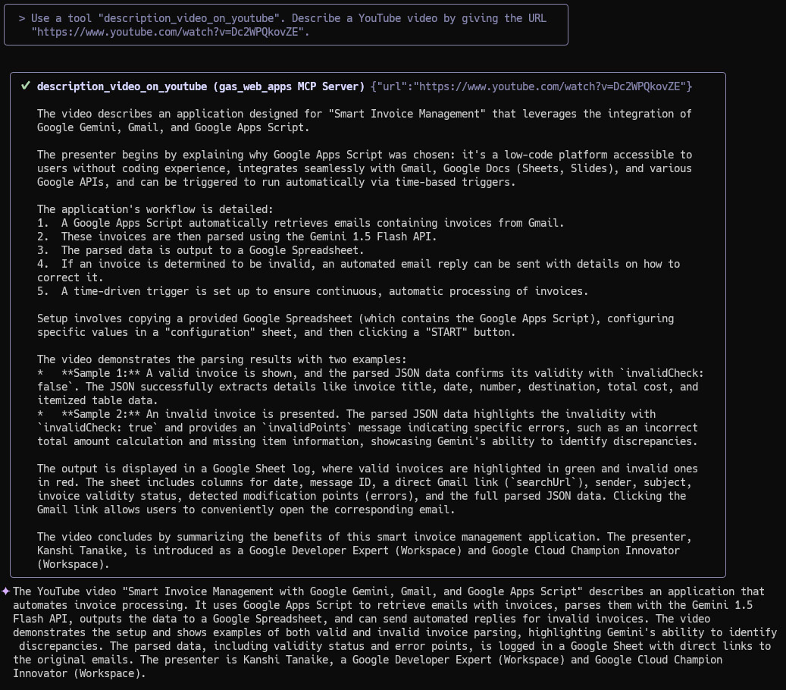

## Search Files in Google Drive

**Prompt**

```text
Search for files with the filename of "sample file" from Google Drive.
```

**Answer**

```text
  ✔  search_file_in_google_drive (gas_web_apps MCP Server) {"query":"name = 'sample file'"}

✦ I found a file named "sample file" on Google Drive. It's a Google Sheet, and here's its link:
  https://docs.google.com/spreadsheets/d/###/edit?usp=drivesdk
```

### Explanation

Gemini interpreted the request and selected the `search_file_in_google_drive` tool from the `gas_web_apps` MCP server. It constructed the appropriate Google Drive search query (`name = 'sample file'`) and executed the search via Google Apps Script, returning the file metadata.

## Show Schedule from Google Calendar

**Prompt**

```text
Tell me my today's schedule.
```

**Answer**

```text
  ✔  search_schedule_on_Google_Calendar (gas_web_apps MCP Server) {"start":"2025-07-03","end":"2025-07-03"}

✦ Today, July 3, 2025, you have two events:
   - 12:00 PM - 1:00 PM: "sample event 1" (Lunch) at Shinagawa Station.
   - 7:00 PM - 8:00 PM: "sample event 2" (Dinner) at Osaka Station.
```

### Explanation

The model used the `search_schedule_on_Google_Calendar` tool, automatically determining the correct start and end dates for "today". The MCP server fetched the events from Google Calendar, and Gemini summarized the results.

## Show Today's Emails

**Prompt**

```text
Tell me my today's emails from tanaike@hotmail.com.
```

**Answer**

```text
  ✔  get_messages_by_search_from_Gmail (gas_web_apps MCP Server) {"query":"from:tanaike@hotmail.com after:2025/07/03"}

✦ Here are your emails from tanaike@hotmail.com for today:

   1. From: Tanaike Kanshi <tanaike@hotmail.com>
      Subject: sample mail 2
      Body: This is a sample mail of No.2.

   2. From: Tanaike Kanshi <tanaike@hotmail.com>
      Subject: sample mail 1
      Body: This is a sample mail of No.1.
```

### Explanation

Gemini utilized the `get_messages_by_search_from_Gmail` tool, correctly formulating a Gmail search query (`from:tanaike@hotmail.com after:2025/07/03`) to meet the constraints of the prompt.

## Send an Email

**Prompt**

```text
I received a souvenir from my friend Tanaike. Create an email to thank him for it. Tanaike's email address is tanaike@hotmail.com.
```

**Answer**

```text
  ✔  auto_new_draft_creation_Gmail (gas_web_apps MCP Server) {"obj":[{"body":"Dear Tanaike,\n\nThank you so much for the wonder…
  A draft email was successfully created. The draft ID is "r-###".

  ✔  send_mails_Gmail (gas_web_apps MCP Server) {"draftIds":["r-###"]}
  Message of "Thank you for the souvenir!" was correctly sent.

✦ I have already sent the email to Tanaike thanking him for the souvenir.
```

The following email was automatically sent to tanaike@hotmail.com:

```text
Dear Tanaike,

Thank you so much for the wonderful souvenir! I really appreciate your
thoughtfulness.

Best regards,
Kanshi Tanaike
```

### Explanation

This prompt required two steps. First, Gemini used `auto_new_draft_creation_Gmail` to generate the email content and create a draft within Gmail via the MCP server. Second, it immediately used the `send_mails_Gmail` tool, passing the draft ID from the first step to send the email.

## Check Weather and Create a Schedule in Google Calendar

This example demonstrates complex orchestration involving web search and multiple MCP tools. This prompt is similar to one found in this reference: [Ref](https://github.com/tanaikech/A2AApp?tab=readme-ov-file#sample-3)

**Prompt**

```text
Check tomorrow's weather conditions at 12 PM around Shinagawa Station and exchange 100 US Dollars for Japanese Yen. Under this condition, will we enjoy eating lunch outside for 1 hour at the retrieved location and that day? Finally, create it as a schedule in Google Calendar.
```

**Answer**

```text
  ✔  GoogleSearch Searching the web for: "latitude and longitude of Shinagawa Station"
  Search results for "latitude and longitude of Shinagawa Station" returned.

  ✔  get_current_date_time (gas_web_apps MCP Server) {"timezone":"Asia/Tokyo"}
  The current date and time are "2025-07-03 11:04:42". Timezone is "Asia/Tokyo".

  ✔  get_exchange_rate (gas_web_apps MCP Server) {"currency_from":"USD","currency_to":"JPY"}
  The raw data from the API is {"amount":1.0,"base":"USD","date":"2025-07-02","rates":{"JPY":144.15}}. The detailed result is as follows. The currency rate at latest from "USD" to "JPY" is 144.15.

  ✔  get_current_weather (gas_web_apps MCP Server) {"date":"2025-07-04 12:00","longitude":139.73917,"latitude":35.62861,"timezo…
  Mainly clear, partly cloudy, and overcast

✦ Tomorrow's weather around Shinagawa Station at 12 PM is expected to be mainly clear, partly cloudy, and overcast. The exchange rate for 100 US Dollars is 14415 Japanese Yen (1 USD = 144.15 JPY).

  Given the weather conditions, it might be enjoyable to eat lunch outside, but there's a chance of it being overcast.

  ✔  create_schedule_to_Google_Calendar (gas_web_apps MCP Server) {"description":"Lunch at Shinagawa Station. Weather: Mainly c…
  An event was created as Start: 2025-07-04 12:00:00, End: 2025-07-04 13:00:00, Title: Outdoor Lunch at Shinagawa Station, Description: Lunch at Shinagawa Station. Weather: Mainly clear, partly cloudy, and overcast. Exchange rate: 1 USD = 144.15 JPY.

✦ The schedule for an outdoor lunch at Shinagawa Station tomorrow, July 4, 2025, from 12:00 PM to 1:00 PM, has been created in your Google Calendar. The description includes the weather forecast (mainly clear, partly cloudy, and overcast) and the exchange rate (1 USD = 144.15 JPY).
```

The following event was automatically created in Google Calendar:

```text
Date: July 4, 2025, from 12:00 PM to 1:00 PM
Title: Outdoor Lunch at Shinagawa Station
Description: Lunch at Shinagawa Station. Weather: Mainly clear, partly cloudy, and overcast. Exchange rate: 1 USD = 144.15 JPY.
```

### Explanation

This involved a complex chain of actions:

1.  Gemini used the standard `GoogleSearch` to find the latitude and longitude of Shinagawa Station.
2.  It used the MCP tool `get_current_date_time` to establish the date.
3.  It used `get_exchange_rate` to find the USD to JPY conversion.
4.  It used `get_current_weather`, inputting the coordinates found in step 1 and the date/time.
5.  Gemini synthesized this information to answer the qualitative question about enjoying lunch.
6.  Finally, it used `create_schedule_to_Google_Calendar`, embedding the retrieved weather and exchange rate information into the event description.

## Add Text to an Existing Google Document (or Spreadsheet)

**Prompt**

```text
Append the following text to the document "sample document 20250703".
<Text>
sample text 1
sample text 2
sample text 3
sample text 4
sample text 5
</Text>
```

**Answer**

```text
  ✔  search_file_in_google_drive (gas_web_apps MCP Server) {"query":"sample document 20250703"}
  "isError": true

  ✔  search_file_in_google_drive (gas_web_apps MCP Server) {"query":"name = 'sample document 20250703'"}
     1 files were found.

  ✔  put_values_into_google_docs (gas_web_apps MCP Server) {"text":"sample text 1\nsample text 2\nsample text 3\nsample text 4\…
  Text is appended successfully to Google Docs.

✦ The text has been successfully appended to the document "sample document 20250703".
```

### Explanation

This example demonstrates Gemini's ability to self-correct when using tools.

1.  Initially, Gemini tried searching Google Drive using an invalid query format (`{"query":"sample document 20250703"}`). The MCP server returned an error (`"isError": true`).
2.  Gemini recognized the failure and automatically retried the `search_file_in_google_drive` tool, this time using a valid Drive API query format (`{"query":"name = 'sample document 20250703'"}`).
3.  Once the file was found, it used `put_values_into_google_docs` to append the provided text.

## Create a New Google Document and Add Text

**Prompt**

```text
Create a new Google Document and put the following text into the Google Document.
<Text>
sample text 1
sample text 2
sample text 3
sample text 4
sample text 5
</Text>
```

**Answer**

```text
  ✔  create_file_to_google_drive (gas_web_apps MCP Server) {"mimeType":"application/vnd.google-apps.document","filename":"New D…
  A file was created on the root folder. The file URL is "https://docs.google.com/document/d/###/edit?usp=drivesdk".

  ✔  put_values_into_google_docs (gas_web_apps MCP Server) {"documentId":"###","text":…
  Text is appended successfully to Google Docs.

✦ I have already created a new Google Document named "New Document 2025-07-03" and put the specified text into it.
```

### Explanation

This required two sequential tools. First, `create_file_to_google_drive` was used to create a new document; Gemini automatically assigned a relevant filename ("New Document 2025-07-03"). Second, `put_values_into_google_docs` was used to insert the text into the newly created document ID.

## Generate Presentation

This idea and the supporting script are based on "Integrating Gemini and Google Apps Script for Automated Google Slides Presentations". [Ref](https://medium.com/google-cloud/integrating-gemini-and-google-apps-script-for-automated-google-slides-presentations-626eedc83166)

**Prompt**

```text
Please create a 3-minute presentation. The title will be "Cooking miso soup". My name is Tanaike. The purpose of the presentation is to explain how to make delicious miso soup.
```

**Answer**

```text
  ✔  generate_presentation_with_google_slides (gas_web_apps MCP Server) {"name":"Tanaike","text":"This presentation will guide …
  Presentation was successfully created. The url is "https://docs.google.com/open?id=###".

✦ The presentation "Cooking misosoup" has been created. You can access it at:
  https://docs.google.com/open?id=###
```

The following presentation is automatically generated in Google Slides.


### Explanation

The Gemini CLI passed the request parameters to the `generate_presentation_with_google_slides` tool on the MCP server. This specific tool in Google Apps Script uses the Gemini API internally (requiring the API key mentioned in the setup) to generate the slide content and structure, then uses the Slides Service to create the presentation.

## Generate a Survey Using Google Forms and Send the URL via Email

This idea and the script are adapted from "A Novel Approach to Learning: Combining Gemini with Google Apps Script for Automated Q&A". [Ref](https://medium.com/google-cloud/a-novel-approach-to-learning-combining-gemini-with-google-apps-script-for-automated-q-a-1cc3a8781066)

**Prompt**

```text
I want to conduct a survey about favorite Japanese foods. Your mission is as follows:
* Generate a survey using Google Forms.
* Send an email to tanaike@hotmail.com including the published URL of the Google Form.
* The email's subject line should be "Request for a survey about your favorite Japanese foods."
* Create the email's body from the subject.
```

**Answer**

```text
  ✔  generate_survey_with_google_forms (gas_web_apps MCP Server) {"title":"Favorite Japanese Foods Survey","itemList":[{"requir…
  The survey was successfully generated as a Google Form. The edit URL and published URL of the form are "https://docs.google.com/forms/d/###/edit" and "https://docs.google.com/forms/d/e/#####/viewform", respectively.

  ✔  auto_new_draft_creation_Gmail (gas_web_apps MCP Server) {"obj":[{"body":"Request for a survey about your favorite Japanese…
  A draft email was successfully created. The draft ID is "r###".

  ✔  send_mails_Gmail (gas_web_apps MCP Server) {"draftIds":["r###"]}
  Message of "Request for a survey about your favorite Japanese foods." was correctly sent.

✦ I have successfully generated the survey and sent the email with the published URL of the Google Form to tanaike@hotmail.com.
```

The following survey is automatically generated in Google Forms.


And the following email is sent to `tanaike@hotmail.com`:

```text
Mail title:
Request for a survey about your favorite Japanese foods.

Mail body:
Request for a survey about your favorite Japanese foods.
Here is the link to the survey: https://docs.google.com/forms/d/e/#####/viewform
```

### Explanation

This required three steps integrating Forms and Gmail:

1.  `generate_survey_with_google_forms` created the form and returned the published URL.
2.  `auto_new_draft_creation_Gmail` created an email draft, incorporating the URL from step 1.
3.  `send_mails_Gmail` sent the drafted email.

## Generate a Quiz Using Google Forms

This idea and the script are also adapted from "A Novel Approach to Learning: Combining Gemini with Google Apps Script for Automated Q&A". [Ref](https://medium.com/google-cloud/a-novel-approach-to-learning-combining-gemini-with-google-apps-script-for-automated-q-a-1cc3a8781066)

**Prompt**

```text
Suggest 5 questions and answers for a quiz with multiple-choice questions for learning Google Apps Script for beginners. Generate the quiz in Google Forms using the questions. The number of choices for each question is 5. The title of the quiz is "Learning Google Apps Script".
```

**Answer**

```text
  ✔  generate_quiz_with_google_forms (gas_web_apps MCP Server) {"title":"Learning Google Apps Script","itemList":[{"required":t…
  The quiz was successfully generated as a Google Form. The edit URL and published URL of the form are "https://docs.google.com/forms/d/###/edit" and "https://docs.google.com/forms/d/e/#####/viewform", respectively.

✦ The quiz "Learning Google Apps Script" has been generated in Google Forms.
   * Edit URL: https://docs.google.com/forms/d/###/edit
   * Published URL: https://docs.google.com/forms/d/e/#####/viewform
```

The following quiz is automatically generated in Google Forms.


### Explanation

Gemini generated the required questions, choices, and correct answers based on the prompt's requirements, and then structured this data into the parameters required by the `generate_quiz_with_google_forms` tool, which created the Google Form.

---

The following samples were added on July 9, 2025.

## Download an image from Google Drive

This example downloads an image file from Google Drive using the `ggsrun` CLI tool.

**Prompt**

```text
Download the file "sample.png" from Google Drive using ggsrun.
```

**Answer**

```text
  ✔  Shell ggsrun d -f sample.png (Download "sample.png" from Google Drive.)
     {"id":"###","name":"sample.png",,,

✦ The file "sample.png" has been downloaded.
```

### Explanation

When this prompt is run, the file `sample.png` is downloaded from Google Drive using the `ggsrun` CLI tool.

## Download an image file from a website and upload it to Google Drive

This example downloads an image file from a website using a shell command and uploads it to Google Drive using the `ggsrun` CLI tool.

**Prompt**
The image at `https://www.gstatic.com/marketing-cms/assets/images/7e/a4/253561a944f4a8f5e6dec4f5f26f/gemini.webp=s96-fcrop64=1,00000000ffffffff-rw` is the Gemini icon from the official brand resource center. [Ref](https://about.google/brand-resource-center/logos-list/)

```text
Download an image from the URL "https://www.gstatic.com/marketing-cms/assets/images/7e/a4/253561a944f4a8f5e6dec4f5f26f/gemini.webp=s96-fcrop64=1,00000000ffffffff-rw" and upload it to Google Drive using ggsrun.
```

**Answer**

```text
  ✔  Shell wget -O /home/adsam/temp/workspace/gemini.webp "https://www.gstatic.com/marketing-cms/assets/images/7e/a4/253561a944…

  ✔  Shell ggsrun u -f "gemini.webp" (Upload the downloaded image to Google Drive using ggsrun.)
     Error: Extension of '.webp' cannot be uploaded.

  ✔  Shell convert /home/adsam/temp/workspace/gemini.webp /home/adsam/temp/workspace/gemini.png (Convert the downloaded .webp image...)

  ✔  Shell ggsrun u -f "gemini.png" (Upload the converted .png image to Google Drive using ggsrun.)
     {"upload_file_name":["gemini.png"],"uploaded_files":[{"id":"###","name":"gemini.png","mimeType":"image/png",,,

✦ The image has been successfully downloaded from the URL, converted to PNG format, and uploaded to Google Drive.
```

### Explanation

When this prompt is run, the following steps are executed:

1. An image file is downloaded using `wget`.
2. An attempt to upload the `.webp` file with `ggsrun` fails.
3. The file is converted to the PNG format using the `convert` command.
4. The converted `.png` file is successfully uploaded to Google Drive.

## Upload a file to Google Drive and rename it

This example uploads a file to Google Drive using the `ggsrun` CLI tool and renames it using the `rename_files_on_google_drive` tool from the MCP server.

**Prompt**

```text
Upload the file "sample.png" to Google Drive using ggsrun with the filename "test.png". And, show the file ID of the uploaded file.
```

**Answer**

```text
  ✔  Shell ggsrun u -f "sample.png:test.png" (Attempt to upload "sample.png" to Google Drive as "test.png"...)
     Error: open sample.png:test.png: no such file or directory.

  ✔  Shell ggsrun u -f "sample.png" (Upload "sample.png" to Google Drive.)
     {"upload_file_name":["sample.png"],"uploaded_files":[{"id":"###","name":"sample.png",,,

  ✔  rename_files_on_google_drive (gas_web_apps MCP Server) {"fileList":[{"fileId":"###","newName…
     FileId: "###". Renamed successfully from "sample.png" to "test.png".

 ✦ The file "sample.png" has been uploaded to Google Drive and renamed to "test.png". The file ID of the uploaded file is ###.
```

### Explanation

When this prompt is run, the following steps are executed:

1. Upload a file from the local PC to Google Drive using `ggsrun`.
2. Rename the uploaded file using the `rename_files_on_google_drive` tool from the MCP server.
3. Return the file ID of the uploaded file.

## Upload a file to Google Drive and send it as an email attachment

**Prompt**

```text
Upload the file "sample.png" using ggsrun, create a draft email with the uploaded file as an attachment, and send the email to "tanaike@hotmail.com".
```

**Answer**

```text
  ✔  Shell ggsrun u -f "sample.png" (Uploads "sample.png" to Google Drive.)
     {"upload_file_name":["sample.png"],"uploaded_files":[{"id":"###","name":"sample.png",,,

  ✔  auto_new_draft_creation_Gmail (gas_web_apps MCP Server) {"obj":[{"to":"tanaike@hotmail.com","attachmentFiles":["###…
     A draft email was successfully created. The draft ID is "r###".

   ✔  send_mails_Gmail (gas_web_apps MCP Server) {"draftIds":["r###"]}
     Message of "Uploaded File: sample.png" was correctly sent.

✦ I have uploaded the file "sample.png", created a draft email with the uploaded file as an attachment, and sent the email to "tanaike@hotmail.com".
```

### Explanation

A file is uploaded to Google Drive using `ggsrun`. Then, a new draft email is created with the uploaded file as an attachment using the `auto_new_draft_creation_Gmail` tool. Finally, the draft email is sent using the `send_mails_Gmail` tool.

## Move a file in Google Drive

**Prompt**

```text
Move the file "sample.png" to the folder "temp_folder" on Google Drive.
```

**Answer**

```text
 ✔  search_file_in_google_drive (gas_web_apps MCP Server) {"query":"name = 'sample.png'"}
    1 files were found.
    The list of found files is returned in the "FileList" JSON array.

 ✔  search_file_in_google_drive (gas_web_apps MCP Server) {"query":"name = 'temp_folder' and mimeType = 'application/vnd.googl…
    1 files were found.
    The list of found files is returned in the "FileList" JSON array.

 ✔  move_files_on_google_drive (gas_web_apps MCP Server) {"fileList":[{"dstId":"###","srcId":"1j…
    File "sample.png" was moved to the folder "temp_folder".

✦ I have moved the file "sample.png" to the folder "temp_folder" on Google Drive.
```

### Explanation

This prompt executes the following steps:

1. The file and folder are located by name to retrieve their IDs using the `search_file_in_google_drive` tool.
2. The file is moved to the destination folder using the `move_files_on_google_drive` tool.

## Upload a PDF file to Google Drive and add a description

The sample PDF file is [PhysRev.48.73.pdf](https://journals.aps.org/pr/pdf/10.1103/PhysRev.48.73). This is from [this page](https://journals.aps.org/pr/abstract/10.1103/PhysRev.48.73).

**Prompt**

```text
Upload the PDF file PhysRev.48.73.pdf to Google Drive using ggsrun and set the description for the file.
```

**Answer**

```text
  ✔  Shell ggsrun u -f "PhysRev.48.73.pdf" (Uploads the PDF file "PhysRev.48.73.pdf" to Google Drive.)
     {"upload_file_name":["PhysRev.48.73.pdf"],"uploaded_files":[{"id":"###",,,

  ✔  generate_description_on_google_drive (gas_web_apps MCP Server) {"fileId":"###"}
     The created description is "This file is a scientific paper titled "The Particle Problem in the General Theory of Relativity" authored by A. Einstein and N. Rosen, published in Physical Review, Volume 48, pages 73-77, on July 1, 1935...

✦ The PDF file PhysRev.48.73.pdf has been uploaded to Google Drive and its description has been set.
```

### Explanation

In this prompt, the PDF file `PhysRev.48.73.pdf` is uploaded to Google Drive using `ggsrun`. Then, a description for the PDF file is generated and set using the `generate_description_on_google_drive` tool from the MCP server.

## Generate an image

**Prompt**

```text
Generate an image of orange juice being poured into a glass, and download it.
```

**Answer**

```text
  ✔  generate_image_on_google_drive (gas_web_apps MCP Server) {"prompt":"orange juice is poured into a glass"}
     An image was successfully generated from a prompt "orange juice is poured into a glass" as a file on Google Drive. The file URL and ID are "https://drive.google.com/file/d/###/view?usp=drivesdk" and "###", respectively.

  ✔  Shell ggsrun d -i ### -o "orange juice is poured into a glass" (Downloads the generated image...)
     {"id":"###","name":"orange juice is poured into a glass",,,,

✦ The image "orange juice is poured into a glass" has been generated and downloaded to your current directory.
```

The following image was generated and downloaded.


### Explanation

An image is generated using the `generate_image_on_google_drive` tool from the MCP server and then downloaded using `ggsrun`.

## Describe a website

**Prompt**

```text
Describe the website "https://tanaikech.github.io/about/".
```

**Answer**

```text
  ✔  description_web_site (gas_web_apps MCP Server) {"urls":["https://tanaikech.github.io/about/"]}
     The website "About · tanaike" belongs to a Japanese scientist with a Ph.D. in Physics, who is also a Google Developer Expert (GDE) in Google Workspace and a Google Cloud Champion Innovator. The individual focuses on creating novel solutions, with some inventions finding practical applications in various industries such as electronics, industrial machinery, architecture, and aerospace. The site provides contact information, including a developer profile, and links to their posts on the Google Cloud Blog, Medium, and Zenn. It also lists their activities on platforms like GitHub, Gists, Qiita, Stack Overflow, and X, showcasing applications, tips, and summaries of Google Apps Script related repositories. The site also includes information about donations via PayPal.Me.

✦ The website "About · tanaike" describes a Japanese scientist with a Ph.D. in Physics, who is also a Google Developer Expert (GDE) in Google Workspace and a Google Cloud Champion Innovator. The individual focuses on creating novel solutions, with some inventions finding practical applications in various industries. The site provides contact information and links to their posts on various platforms like Google Cloud Blog, Medium, Zenn, GitHub, and Stack Overflow, showcasing applications, tips, and summaries of Google Apps Script related repositories.
```

### Explanation

In this example, a description of the website is generated using the `description_web_site` tool from the MCP server.

## Describe a PDF file on the local PC

**Prompt**

```text
Upload the PDF file PhysRev.48.73.pdf to Google Drive using ggsrun and return a summary of the PDF file within 100 words.
```

**Answer**

```text
  ✔  Shell ggsrun u -f "PhysRev.48.73.pdf" (Uploads the PDF file to Google Drive.)
     {"upload_file_name":["PhysRev.48.73.pdf"],"uploaded_files":[{"id":"###",,,

  ✔  summarize_file_on_google_drive (gas_web_apps MCP Server) {"prompt":"Summarize this PDF file within 100 words.","fileId":"1…
     Einstein and Rosen investigate the particle problem in general relativity, aiming to describe elementary particles without singularities. They propose a slight modification to the gravitational equations, allowing for regular solutions. In this framework, particles are represented as "bridges" connecting two identical "sheets" of space. This approach provides a singularity-free description for neutral and charged particles. The most natural charged particle in this model is found to have zero gravitational mass. The theory offers a unified, consistent view using only gravitational and electromagnetic fields, explaining the atomistic nature of matter and the absence of negative neutral mass.

✦ The PDF file "PhysRev.48.73.pdf" has been uploaded to Google Drive and summarized as follows:
  "Einstein and Rosen investigate the particle problem in general relativity, aiming to describe elementary particles without singularities. They propose a slight modification to the gravitational equations, allowing for regular solutions. In this framework, particles are represented as 'bridges' connecting two identical 'sheets' of space. This approach provides a singularity-free description for neutral and charged particles. The most natural charged particle in this model is found to have zero gravitational mass. The theory offers a unified, consistent view using only gravitational and electromagnetic fields, explaining the atomistic nature of matter and the absence of negative neutral mass."
```

### Explanation

A PDF file is uploaded to Google Drive using `ggsrun`, and a summary is generated using the `summarize_file_on_google_drive` tool from the MCP server.

## Generate a roadmap and download it as a PDF file

**Prompt**

```text
I want to cook miso soup. To achieve this goal, create a new Google Spreadsheet, generate a roadmap for cooking miso soup in the spreadsheet, and download it as a PDF file using ggsrun.
```

**Answer**

```text
  ✔  create_file_to_google_drive (gas_web_apps MCP Server) {"filename":"Miso Soup Roadmap","mimeType":"application/vnd.google-a…
     A file was created on the root folder. The file URL is "https://docs.google.com/spreadsheets/d/###/edit?usp=drivesdk".

  ✔  generate_roadmap_to_google_sheets (gas_web_apps MCP Server) {"spreadsheetId":"###…
     Roadmap was successfully generated in Google Sheets. The spreadsheet ID and the sheet name are "###" and "Sheet1" (sheet ID: "0"), respectively. The URL is "https://docs.google.com/spreadsheets/d/###/edit". The file ID of the converted PDF file is "###".

✦ I can run ggsrun d -i ###. This will download the PDF file of the miso soup roadmap from Google Drive to your local machine.

  ✔  Shell ggsrun d -i ### (Download the generated PDF roadmap from Google Drive.)

✦ I have successfully created the Google Spreadsheet, generated the roadmap for cooking miso soup, and downloaded it as a PDF file named Cook Miso Soup.pdf.
```

As a result, the following roadmap is generated and saved as a PDF file:


### Explanation

When this prompt is run, the following steps are executed:

1. Create a new Google Spreadsheet using the `create_file_to_google_drive` tool from the MCP server.
2. Generate a roadmap in the new spreadsheet using the `generate_roadmap_to_google_sheets` tool.
3. Download the roadmap as a PDF file from Google Drive using `ggsrun`.

## Generate presentation based on a web site and send it as an email

**Prompt**

```text
Describe the Web site of "https://blog.google/technology/developers/introducing-gemini-cli-open-source-ai-agent/", and think of a title and create a new Google Document and put the generated description into the document by giving the title. And, generate a presentation of Google Slides using the title and document. And, create an email including the URL of the presentation and send it to "tanaike@hotmail.com".
```

**Answer**

```text
  ✔  description_web_site (gas_web_apps MCP Server) {"urls":["https://blog.google/technology/developers/introducing-gemini-cli-…
     The site describes the introduction of Gemini CLI, an open-source AI agent that integrates Gemini directly into
     developers' terminals. This tool offers free access to Gemini 2.5 Pro for individual Google account holders,
     with high usage limits for model requests. Gemini CLI aims to enhance the command-line experience by enabling
     coding, problem-solving, content generation, and task management using natural language. It shares technology
     with Gemini Code Assist, providing AI assistance in both the terminal and VS Code. The article highlights
     Gemini CLI's open and extensible nature, encouraging community contributions.

  ✔  create_file_to_google_drive (gas_web_apps MCP Server) {"mimeType":"application/vnd.google-apps.document","filename":"Intro…
     A file was created on the root folder. The file URL is "https://docs.google.com/document/d/###/edit?usp=drivesdk".

  ✔  put_values_into_google_docs (gas_web_apps MCP Server) {"text":"The site describes the introduction of Gemini CLI, an open-…
     Text is appended successfully to Google Docs.

  ✔  generate_presentation_with_google_slides (gas_web_apps MCP Server) {"name":"Kanshi Tanaike","title":"Introducing Gemini CL…
     Presentation was successfully created. The url is "https://docs.google.com/open?id=###".

  ✔  auto_new_draft_creation_Gmail (gas_web_apps MCP Server) {"obj":[{"body":"Here is the presentation on Introducing Gemini CL…
     A draft email was successfully created. The draft ID is "r-###".

  ✔  send_mails_Gmail (gas_web_apps MCP Server) {"draftIds":["r-###"]}
     Message of "Presentation: Introducing Gemini CLI: An Open-Source AI Agent" was correctly sent.

✦ I have successfully described the website, created a Google Document with the description and a title, generated a Google Slides presentation, and sent an email with the presentation URL to "tanaike@hotmail.com".
```

The following email was sent.

```text
Mail subject: Presentation: Introducing Gemini CLI: An Open-Source AI Agent
Mail body: Here is the presentation on Introducing Gemini CLI: An Open-Source AI Agent: https://docs.google.com/open?id=###
```

When the URL is opened, the following presentation was generated.


### Explanation

When this prompt is run, the following steps are executed:

1. A tool `description_web_site` generates a description of the web site.
2. A tool `create_file_to_google_drive` creates a new Google Document.
3. A tool `put_values_into_google_docs` puts the generated description into the created document.
4. A tool `generate_presentation_with_google_slides` generates a presentation to Google Slides using the title and Google Document.
5. A tool `auto_new_draft_creation_Gmail` creates a draft email including the URL of the Google Slides.
6. A tool `send_mails_Gmail` sends the email.

---

The following samples were added on July 10, 2025.

## Generate presentation based on a web site and send it as an email

**Prompt**

```text
Create a new Google Document and send an email to tanaike@hotmail.com that includes the document. Grant the user edit permission for the Google Document.
```

**Answer**

```text
  ✔  create_file_to_google_drive (gas_web_apps MCP Server) {"filename":"New Google Document","mimeType":"application/vnd.google…
     A file was created on the root folder. The file URL is "https://docs.google.com/document/d/###/edit?usp=drivesdk".

  ✔  change_permission_of_file_on_google_drive (gas_web_apps MCP Server) {"role":"editor","fileId":"###…
     Permission for the file 'New Google Document' (ID: ###) was successfully updated. User 'tanaike@hotmail.com' has been granted 'editor' access.

  ✔  auto_new_draft_creation_Gmail (gas_web_apps MCP Server) {"obj":[{"title":"New Google Document","to":"tanaike@hotmail.com",…
     A draft email was successfully created. The draft ID is "r###".

  ✔  send_mails_Gmail (gas_web_apps MCP Server) {"draftIds":["r###"]}
     Message of "New Google Document" was correctly sent.

✦ I have created a new Google Document, granted edit permission to tanaike@hotmail.com, and sent an email to them with the
  document link.
```

When this is run, an email including the URL of the Google Document. And, the write permission was added to the email.

---

The following samples were added on July 24, 2025.

## Describe YouTube

**Prompt**

```text
Use a tool "description_video_on_youtube". Describe a YouTube video by giving the URL "https://www.youtube.com/watch?v=Dc2WPQkovZE".
```

**Answer**



## Convert markdown to Google Docs and export as a PDF

In this case, [ggsrun](https://github.com/tanaikech/ggsrun) of a CLI tool is used for exporting the file from Google Drive. So, `GEMINI.md` is set. [Ref](#configggsrun)

**Prompt**

```text
Please follow these steps:

1.  Review @PhysRev.48.73.pdf.
2.  Summarize the PDF content in Markdown format.
3.  Generate a Google Document from the Markdown as a temporary file.
4.  Export the Google Document as a PDF using ggsrun.
5.  Remove the temporary file.
```

**Answer**


By this flow, a PDF file is saved as a file in the working directory.

---

The following samples were added on July 29, 2025.

In this case, you can see the samples at **"[Next-Level Data Automation: Gemini CLI, Google Calendar, and MCP](https://medium.com/@tanaike/next-level-data-automation-gemini-cli-google-calendar-and-mcp-1b9e39e75f34)"**.

---

The following samples were added on August 1, 2025.

In this case, you can see the samples at **"[Enhanced Guide to Using Prompts in Gemini CLI](https://medium.com/@tanaike/enhanced-guide-to-using-prompts-in-the-gemini-cli-817cbce97e46)"**.

---

The following samples were added on August 10, 2025.

In this case, you can see the samples at **"[Next-Level Classroom Automation: Gemini CLI, Google Classroom, and MCP](https://medium.com/google-cloud/next-level-classroom-automation-gemini-cli-google-classroom-and-mcp-ac4bb9103fa6)"**.

---

The following samples were added on August 18, 2025.

In this case, you can see the samples at **"[Unifying Google Workspace with Natural Language: Integrated Collaboration through Gemini CLI and MCP](https://medium.com/@tanaike/unifying-google-workspace-with-natural-language-integrated-collaboration-through-gemini-cli-and-a40489ddf17e)"**.

---

The following samples were added on August 22, 2025.

In this case, you can see the samples at **"[Streamlining Web Page Insights with Natural Language using Gemini CLI, Google Analytics, and MCP](https://medium.com/@tanaike/streamlining-web-page-insights-with-natural-language-using-gemini-cli-google-analytics-and-mcp-1774d2b735b7)"**.

---

The following samples were added on September 11, 2025.

In this case, you can see the samples at **"[Google Maps with Natural Language: Integrated Collaboration through Gemini CLI and MCP](https://medium.com/google-cloud/google-maps-with-natural-language-integrated-collaboration-through-gemini-cli-and-mcp-07ba309593b3)"**.

---

The following samples were added on September 24, 2025.

In this case, you can see the samples at **"[Streamlining Content Creation: A Guide to Using Gemini CLI, MCP Server, and VSCode](https://medium.com/google-cloud/streamlining-content-creation-a-guide-to-using-gemini-cli-mcp-server-and-vscode-e623c42419f5)"**.
